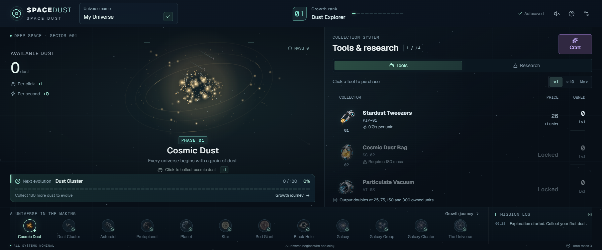

# SPACE DUST

**먼지 한 알을 클릭해, 나만의 우주를 키우는 클리커 게임.**

[지금 플레이하기](https://spacedust-nine.vercel.app/) · [English](docs/README.en.md)



## 아들의 상상으로 만든 게임

초등학생 아들이 “우주먼지를 모으는 게임을 만들어 달라”고 해서 몇 시간 만에 만든 웹게임입니다. 기획도 아들이 원하는 대로 했습니다. 먼지가 뭉쳐 행성이 되고, 블랙홀을 넘어 우주 전체로 자라나는 흐름부터 SF 수집 로봇, 날아오는 혜성, 별자리 제작까지 아들의 아이디어와 손으로 적은 기획을 게임으로 옮겼습니다.

처음에는 직접 클릭하며 작은 먼지를 모읍니다. 그러다 수집 도구를 사고, 연구로 생산량을 늘리고, 모은 자원으로 별자리를 완성하면서 점점 더 큰 우주를 만들어 갑니다. **다음 천체는 어떤 모습일지, 다음 도구는 얼마나 강할지 발견하는 게임**입니다.

## 어떻게 플레이하나요?

1. **가운데 천체를 클릭해 먼지를 모으세요.** 작은 입자가 떠다니는 우주먼지부터 시작합니다. 클릭과 자동 수집으로 성장하면서 천체의 모습과 연출이 달라집니다.
2. **수집 도구를 사서 자동화하세요.** 오른쪽에서 도구를 클릭하면 구매됩니다. 작은 `Stardust Tweezers`부터 `Comet Tail Inceptor`, `Cosmic Rebirth`까지 14종이 있으며, 1개·10개·최대 수량으로 구매할 수 있습니다.
3. **연구로 수집 효율을 높이세요.** 도구별 성능을 두 배로 만드는 업그레이드 28개, 도구끼리 힘을 보태는 상호작용 12개, 수동 클릭 강화 3단계가 있습니다. 어떤 도구와 연구에 먼저 투자할지 골라 보세요.
4. **지나가는 혜성을 놓치지 마세요.** 화면을 가로지르는 혜성을 클릭하면 보너스 먼지를 얻습니다. 황금 혜성은 더 큰 보상을 줍니다.
5. **Craft에서 별자리를 완성하세요.** 먼지를 특수 재화로 전환하고, 도구와 재화를 재료로 써서 별을 하나씩 제작합니다. 별과 별자리를 완성하면 영구 보너스를 얻고, 나중에는 최상위 도구도 열립니다.

## 먼지에서 우주 전체까지

성장은 12단계로 이어집니다. 블랙홀 이후에도 은하와 더 큰 우주가 기다립니다.

> 우주먼지 → 먼지 덩어리 → 소행성 → 원시행성 → 행성 → 항성 → 적색거성 → 블랙홀 → 은하 → 은하군 → 은하단 → 우주 전체

떠다니는 입자, 천체 주변을 도는 궤도, 빛과 꼬리 효과가 성장에 따라 달라집니다. 클릭으로 시작한 작은 점이 화면을 채우는 우주가 되는 과정을 지켜보세요.

## 별자리와 특수 재화

Craft에는 **서로 다른 모양의 별자리 15개와 제작할 별 60개**가 있습니다. 별을 선택하면 필요한 재료를 확인할 수 있고, 제작할 때 먼지·도구·특수 재화가 실제로 소모됩니다. 뒤로 갈수록 더 강한 도구와 많은 재료가 필요합니다.

특수 재화는 `Stardust`, `Moondust`, `Galaxydust`, `Solardust`, `Spacedust`의 다섯 종류입니다. 전환 상품을 구매하면 일반 재화 한 종류를 무작위로 뽑아 전량 지급합니다. 희귀한 Spacedust는 와일드카드 재료로도 사용할 수 있습니다.

재화는 별자리 재료뿐 아니라 혜성 출현 빈도, 클릭 수집량, 혜성 보상 등을 영구적으로 강화하는 데에도 쓰입니다. 별자리를 완성하면 추가 보너스와 럭키박스를 얻으며, 5개·10개·15개 완성 시 최상위 도구가 하나씩 해금됩니다.

## 가볍게 시작하기

설치나 가입 없이 **[브라우저에서 바로 플레이](https://spacedust-nine.vercel.app/)** 할 수 있습니다. 게임 화면은 영어이며, 1800 × 750 가로 화면에 맞춰 구성했고 모바일 화면도 지원합니다. 진행도 자동 저장, 최대 8시간의 오프라인 수집, 소리 및 모션 줄이기 설정이 있습니다.

## 자유롭게 가져가서 만들어 보세요

이 프로젝트는 **[MIT 라이선스](LICENSE)**로 공개합니다. 자유롭게 내려받아 플레이하고, 코드를 수정하거나 개선하고, 다른 프로젝트에 활용하거나 재배포해도 됩니다. 상업적 이용도 가능합니다. 복사하거나 배포할 때에는 원래의 저작권 표시와 라이선스 문구를 함께 남겨 주세요.

새로운 천체나 도구를 더해도 좋고, 밸런스를 바꾸거나 자신만의 클리커 게임으로 만들어도 좋습니다. 이 작은 게임이 또 다른 아이디어의 출발점이 되면 좋겠습니다.

## 직접 실행하고 수정하기

Node.js 24.21.0 이상(24.x)을 사용합니다. React 19, TypeScript, Vinext/Vite, Tailwind CSS, Base UI로 만들었습니다.

```sh
npm ci
npm run dev -- --hostname 127.0.0.1
```

[http://localhost:3000](http://localhost:3000)에서 실행됩니다.

```sh
npm run check         # 린트, 타입 검사, 게임 테스트, 포맷 검사
npm run build:vercel  # 정적 웹사이트 빌드 → dist/client
```

화면은 `app/`과 `components/`, 도구와 천체 데이터는 `lib/catalog.ts`, 게임 규칙은 `lib/economy.ts`, 별자리 구성은 `lib/constellations.ts`에서 수정할 수 있습니다. 세부 제작 규칙은 [워크숍 문서](docs/workshop-update.md)를 참고하세요.
